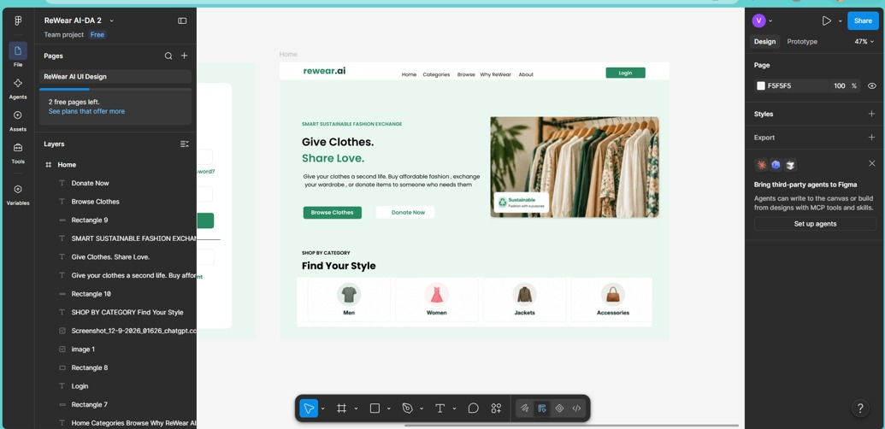
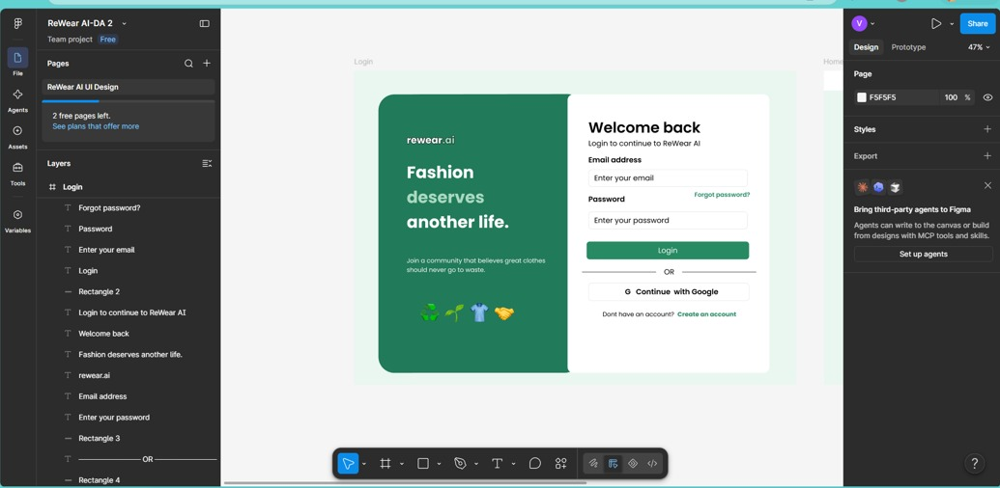
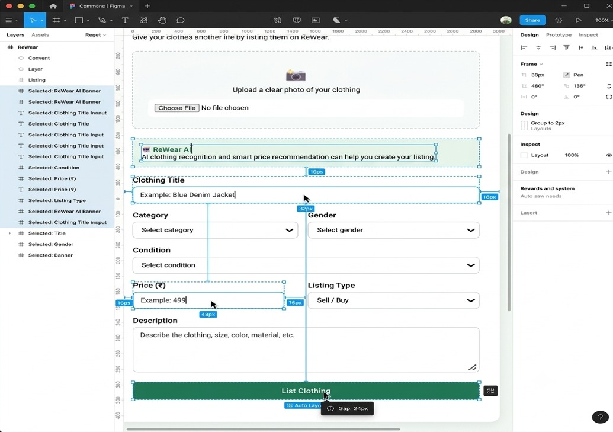
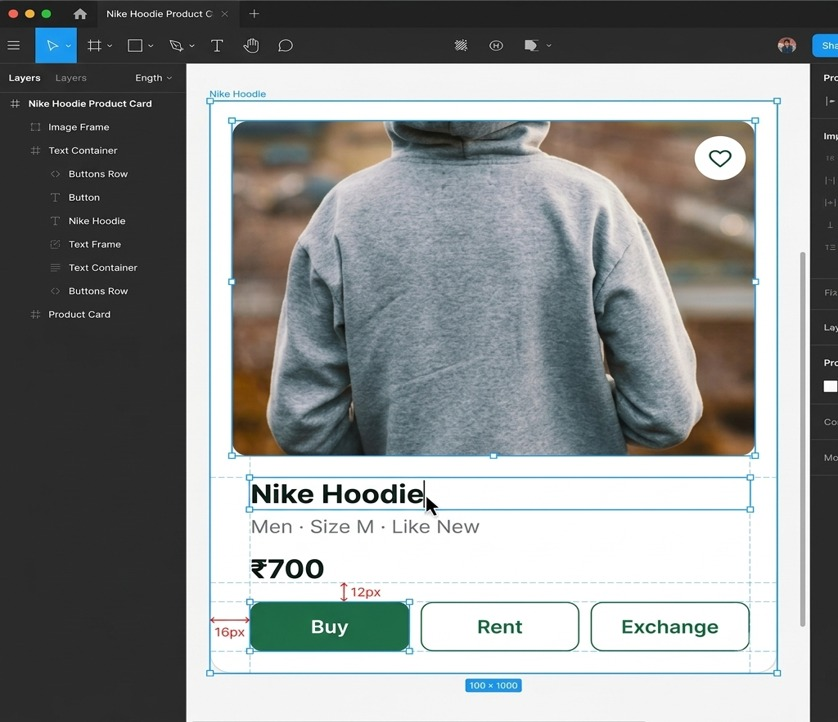
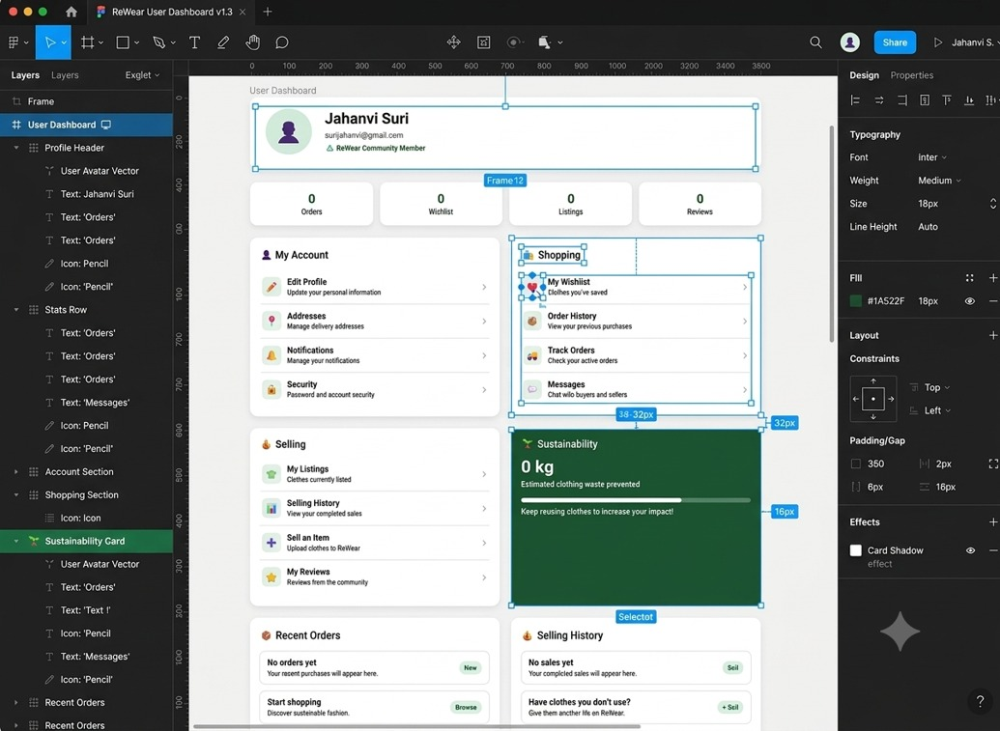
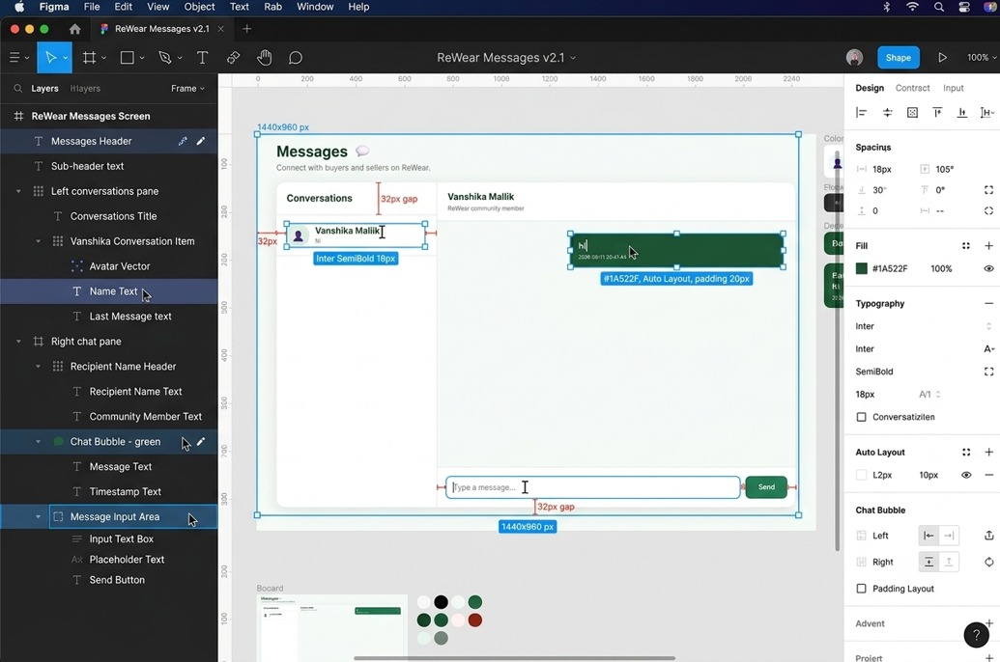

# ReWear Web App

ReWear is a web application developed to promote the reuse of clothes. Users can create accounts, browse clothing items, upload clothing listings, and manage their profiles and listings.

## Features

- User Signup and Login
- Browse clothing items
- Upload clothing listings
- View and manage personal listings
- User Profile
- Chat functionality
- Simple and user-friendly interface

## Technology Stack

| Technology | Purpose |
|---|---|
| HTML | Structure of web pages |
| CSS | Styling and layout |
| JavaScript | Client-side functionality |
| Node.js | Backend and server-side functionality |
| SQLite | Database management |
| Figma | User interface design |

## Project Structure

```text
ReWear/
│
├── Design/
│   ├── 1swe.jpeg
│   ├── 2swe.jpeg
│   ├── 3swe.jpeg
│   ├── 4swe.jpeg
│   ├── 5swe.jpeg
│   ├── 6swe.jpeg
│   └── Figma
│
├── architecture/
│   ├── .gitkeep
│   └── WhatsApp Image 2026-09-12 at 2.51.16 AM.jpeg
│
├── backend/
│   ├── .gitkeep
│   ├── package-lock.json
│   ├── package.json
│   └── server.js
│
├── database/
│   ├── .gitkeep
│   └── 1789158084991-Screenshot 2026-09-12 001347.png
│
├── docker/
│
├── docs/
│
├── frontend/
│   ├── .gitkeep
│   ├── chat.html
│   ├── index.html
│   ├── login.html
│   ├── my-listings.html
│   ├── profile.html
│   ├── signup.html
│   ├── upload.html
│   └── screenshots/
│
├── wireframes/
│
└── .gitignore
```

# Software Design

## 1. Design Principles

The ReWear application follows the following design principles:

### Abstraction

The system hides the internal backend and database operations from the user. Users interact with the application through simple web pages and forms.

### Modularity

The project is divided into separate parts such as frontend, backend, database, architecture, documentation, and design files. This makes the project easier to manage and update.

### Cohesion

Each part of the application has a specific purpose. For example, the frontend contains the user interface pages, while the backend contains server-side functionality.

### Low Coupling

The frontend and backend are kept as separate parts of the system. The frontend communicates with the backend when data or server-side operations are required.

## 2. High-Level Architecture

ReWear follows a client-server based architecture.

### Architecture Diagram


The architecture diagram shows the main components of the ReWear application and their interaction.

The editable/source architecture files are maintained in the `architecture/` folder.

## 3. User Interface Design

The user interface was designed using Figma. The six UI screens are stored in the `Design/` folder.

### Screen 1



### Screen 2



### Screen 3



### Screen 4



### Screen 5



### Screen 6



The interface uses clear navigation, simple forms, consistent buttons, and a clean layout so that users can easily access the main features of the application.

## 4. Main Design Decisions

- **Simple and clean interface:** The UI is designed to make the main functions easy to understand.
- **Consistent design:** Similar colors, buttons, and layouts are used across the different screens.
- **Separate frontend and backend:** The frontend handles the user interface while the backend handles server-side operations.
- **Separate modules:** Frontend, backend, database, design, and documentation are organized separately.
- **Clear navigation:** Users can easily move between the main sections of the application.

## 5. GitHub Design Files

The repository contains the software design materials in separate folders.

- `Design/` contains the Figma UI screenshots.
- `architecture/` contains the architecture diagram.
- `docs/` contains project documentation.
- `wireframes/` contains the wireframe-related files.

## 6. Frontend

The frontend contains the main pages of the ReWear application:

- `index.html` - Home page
- `login.html` - Login page
- `signup.html` - Signup page
- `profile.html` - User profile
- `upload.html` - Upload clothing
- `my-listings.html` - User listings
- `chat.html` - Chat functionality

## 7. Backend

The backend is implemented using Node.js.

The main backend files are located in the `backend/` folder:

```text
backend/
├── package.json
├── package-lock.json
└── server.js
```

## 8. Database

The project uses SQLite for storing application data.

Database-related files and supporting material are maintained in the `database/` folder.

## Setup and Running

1. Install Node.js.
2. Clone or download the ReWear repository.
3. Open the project in VS Code.
4. Open the terminal in the `backend/` folder.
5. Install the required packages:

```bash
npm install
```

6. Start the server:

```bash
node server.js
```

7. Open the application in a web browser using the local server address.

## Current Project Status

The current ReWear Web App contains the frontend pages, Node.js backend, database-related files, UI designs, architecture diagram, documentation, and wireframes.

The project is organized into separate folders to make the code and design materials easier to manage.
